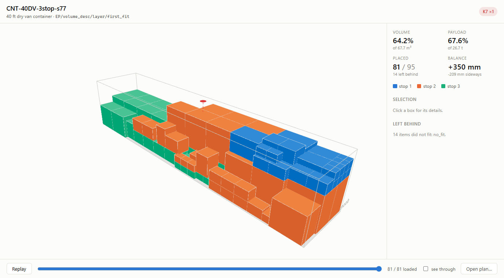
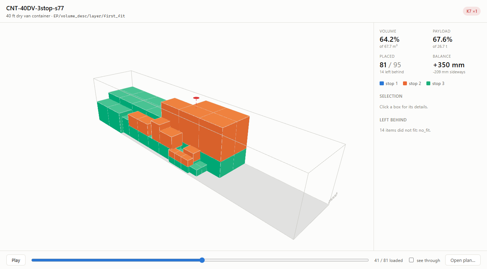
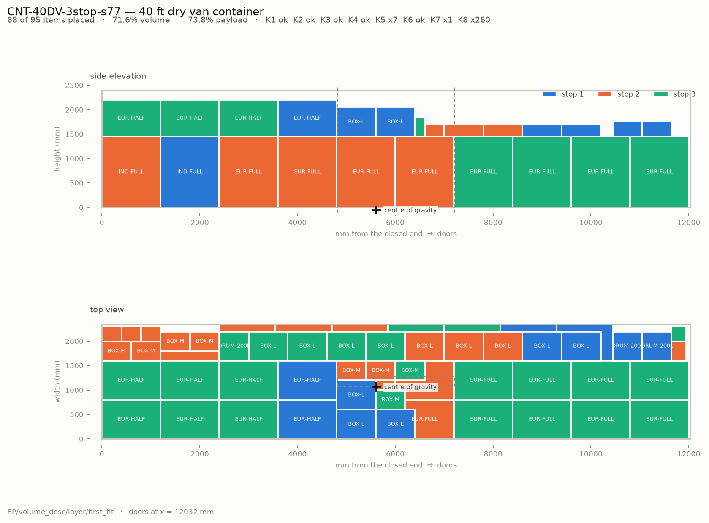

# LoadZa

3D container loading optimisation. Given a list of goods and a vehicle, LoadZa
computes a **physically valid** placement for every box — position, orientation
and loading order — then visualises it and prints a loading plan.

The underlying problem is the **Container Loading Problem (CLP)**, a
constrained 3D bin packing problem. It is NP-hard: there is no practical exact
solver, so LoadZa combines a constructive heuristic with a metaheuristic
improvement pass and measures the result against published benchmark data.

> **82.1% mean volume utilisation across all 700 published BR1–BR7 instances**,
> rising to **83.4% with an 8 second search**, and not one invalid plan in any
> run.
>
> **[Try the viewer →](https://hamzamra.github.io/LoadZa/)** — a solved
> three-drop container load, no install required.

## Why it is not a packing toy

| Concern | How it is handled |
|---|---|
| Boxes must not overlap or leave the vehicle | Exact integer AABB tests, no floating point geometry |
| Boxes must not float | Support ratio check: ≥70% of a footprint must rest on something |
| Stacks must not crush the bottom box | Recursive weight chain against each type's stacking limit |
| The trailer must not be lopsided | Centre-of-gravity offset checked against lateral and lengthwise tolerances |
| Multi-drop unloading | LIFO reachability: stop *n* must not be buried behind stop *n+1* |
| "Is the answer any good?" | Independent validator + benchmark runs on Bischoff & Ratcliff / Loh & Nee data |

The validator is a separate module from the solver on purpose. A solver that
grades its own output hides its bugs.

## Constraints

| ID | Constraint |
|---|---|
| K1 | No two boxes overlap |
| K2 | Every box stays inside the loading space |
| K3 | Total weight ≤ vehicle payload |
| K4 | Support ratio ≥ threshold (nothing floats) |
| K5 | Weight above a box ≤ its stacking limit |
| K6 | Orientation limits (fragile, this-side-up) |
| K7 | Centre of gravity within tolerance |
| K8 | Multi-drop LIFO reachability |

K1–K3 are hard: violating them makes a plan invalid. K4–K8 are realism
constraints and may also be handled as penalties.

All eight are checked by `core/validator.py`, which shares no code with the
solver — it recomputes overlap, support and load transfer from the placement
coordinates with plain nested loops. A shared helper would let one bug pass
both the solver and its own audit.

What the solver guarantees, and what it does not:

| | K1 | K2 | K3 | K4 | K5 | K6 | K7 | K8 |
|---|---|---|---|---|---|---|---|---|
| enforced by the solver | ✓ | ✓ | ✓ | ✓ | ✓ | ✓ | part | ✓ |
| checked by the validator | ✓ | ✓ | ✓ | ✓ | ✓ | ✓ | ✓ | ✓ |

The constraints are handled by three different mechanisms, because they are
three different kinds of thing:

- **Local** — K1, K2, K3, K4, K6 are decided by looking at one candidate
  position, so they are filters inside the placement loop.
- **Cumulative** — K5 and K8 depend on what is already loaded. The solver
  carries a running load figure per box, pushed down the support tree in
  proportion to contact area, and packs delivery stops in reverse order so the
  first drop finishes nearest the doors.
- **Global** — K7 is a property of the finished load; no greedy filter can
  enforce it. The whole packed block is translated along the vehicle
  afterwards, which moves the centre of gravity without disturbing a single
  relative position.

**K7 is only half solved, and deliberately so.** Translation fixes the
lengthwise balance whenever there is free length, which in practice is always.
Sideways there is usually no free width, so the residual lean has to be decided
during packing — and a greedy side-choice rule measurably makes some loads
worse while fixing others: on the demo jobs it fixed one (−157 → −1 mm) and
worsened another (−28 → −129 mm). `balance_lateral` therefore exists and
defaults off. The code stays so the next person can see it was tried; lateral
balance belongs to a global search, not a greedy rule.

## Layout

```
core/      domain model, geometry, solver, improvement, validator  (pure Python)
tools/     command line utilities, synthetic job generator
tests/     pytest suite
bench/     OR-Library instance parser and benchmark runner
app/       FastAPI service and SQLite persistence
web/       React + three.js viewer
data/demo/ generated example jobs
docs/      notes, screenshots
```

`core/` never imports from `app/` or `web/`. It has no third-party runtime
dependencies, so benchmarks run without a web server and the solver stays
portable.

## Conventions

- **Millimetres and grams, integers only.** Floating point geometry produces
  overlap tests that are almost right, which is worse than useless.
- **Origin at the front-left-bottom corner** — the closed end, furthest from
  the doors. `x` runs along the length towards the doors, `y` across the width,
  `z` up. Filling outwards from the origin therefore fills the deep end first,
  which is how a trailer is actually loaded.
- **Orientation names read in axis order.** `LWH` means length→x, width→y,
  height→z; `WLH` is the same box turned 90° about the vertical axis.
- Frozen dataclasses everywhere; the solver replaces rather than mutates.

## Quick start

```bash
git clone <repo-url> && cd LoadZa
python -m pip install -e ".[dev]"

# generate a synthetic job (13.6 m curtainside, mixed freight, 5% over-supplied)
python -m tools.gen_demo --vehicle TIR-1360 --mix mixed --fill 1.05 --seed 42

# solve it
python -m tools.solve data/demo/TIR-1360-mixed-s42.json

# audit the result, then draw it (needs the viz extra)
python -m tools.validate data/demo/TIR-1360-mixed-s42.json \
    data/plans/TIR-1360-mixed-s42-dbl-first_fit.json --explain 5
python -m tools.view data/demo/TIR-1360-mixed-s42.json \
    data/plans/TIR-1360-mixed-s42-dbl-first_fit.json

# spend 20 seconds searching item orders for a better plan
python -m tools.improve data/demo/TIR-1360-mixed-s42.json --seconds 20

# benchmark against the published instances
python -m tools.fetch_datasets
python -m bench.run_bench --limit 10
python -m bench.run_bench --limit 10 --anneal-seconds 8

pytest
```

Or drive it over HTTP:

```bash
pip install -e ".[api]"
uvicorn app.api:app --reload            # interactive docs at /docs

curl -X POST localhost:8000/jobs -H 'content-type: application/json' \
     -d @data/demo/TIR-1360-mixed-s42.json
curl -X POST localhost:8000/jobs/TIR-1360-mixed-s42/solve \
     -H 'content-type: application/json' -d '{"anneal_seconds": 10}'
curl localhost:8000/jobs/TIR-1360-mixed-s42/plans     # every plan, best first
```

| Endpoint | Does |
|---|---|
| `GET /catalog` | Vehicles and unit-load types to build a job from |
| `POST /jobs` | Store a job document |
| `POST /jobs/{id}/solve` | Solve or anneal, audit, store, return the metrics |
| `GET /jobs/{id}/plans` | Compare every plan of a job, best utilisation first |
| `GET /plans/{id}` | The full plan document, as the viewer consumes it |
| `GET /plans/{id}/report.pdf` | Printable loading plan: drawings and pick list |
| `GET /plans/{id}/report.xlsx` | The pick list as a spreadsheet |
| `POST /validate` | Audit any job and plan, including ones from elsewhere |

Every stored plan carries the validator's verdict — a plan in the database that
nobody had checked would be worse than no plan at all.

## Browser workbench

Everything happens on the page — build a job from the catalogue, solve it, look
at it, and solve it again with a constraint turned off to see what that
constraint costs.

```bash
docker compose up --build                # → http://localhost:8000
```

One image: the viewer is built with Node and served by the API, so there is one
port and no reverse proxy to configure. Jobs live on a named volume, because a
service that forgets every job it solved when it restarts is a demo.

For development, two terminals and hot reload:

```bash
uvicorn app.api:app                      # terminal 1, from the repo root
cd web && npm install && npm run dev     # terminal 2 → http://localhost:5173
```



A three-drop load, coloured by delivery stop. The last stop is packed deepest
and the first finishes at the doors, so nothing is unloaded twice. Click a box
for its details; the disc above the roof is the centre of gravity, red here
because it sits outside the sideways tolerance — the same `K7 ×1` the badge
reports.

The slider replays the loading order, which is the plan's real output: a
sequence a person can follow, deep end first and bottom up.



With no `?plan=` in the query string the page loads a bundled sample, so the
built bundle is a working demo on a static host with no service behind it.
English and Turkish, toggled top right; the choice is remembered and defaults
to the browser's preference.

The same plan as a printable schematic, from `python -m tools.view`:



## More cargo than one vehicle

```bash
python -m tools.fleet data/demo/FLEET-DEMO.json --fleet CNT-20DV CNT-40HC TIR-1360
```

```
trip  vehicle       boxes   volume  payload    weight
1     TIR-1360        135    63.3%    89.5%    21.49t
2     CNT-20DV          9    36.5%    18.9%     5.33t
total 2               144    70.0%             26.81t
```

Fill a vehicle with the ordinary solver, take what it left behind, start the
next one. Greedy and not optimal — but every trip is a real solve, so each one
obeys the same constraints and answers to the same validator. A cleverer split
that reasoned about volumes without packing would produce numbers nobody could
load.

**Vehicle choice is by volume loaded, not by utilisation.** Picking the better
percentage sends three 20 ft containers at 75% each; picking the larger load
sends one trailer and a container. Utilisation is a ratio and a ratio always
flatters the smallest vehicle — fewer vehicles is what the dispatcher pays for.
`POST /jobs/{id}/assign` stores each trip as a job of its own, so the viewer,
the reports and the validator all work on them with no new code.

## Paperwork

```bash
python -m tools.report data/demo/job.json data/plans/plan.json
```

A two-part PDF — the drawings with per-stop totals on page one, then the pick
list in loading order — and the same list as a spreadsheet with a summary
sheet. Both are also served straight from the API, and the viewer links to
them.

[Example loading plan (PDF)](docs/CNT-40DV-3stop-s77-layer-first_fit.pdf)

The PDF is drawn with matplotlib rather than an HTML-to-PDF engine. WeasyPrint
and its relatives want GTK or Qt native libraries, which turns "clone and run"
into an afternoon on Windows; matplotlib was already there for the schematic
and draws the tables too.

Available vehicles: `TIR-1360` (13.6 m curtainside semi-trailer), `CNT-20DV`,
`CNT-40DV`, `CNT-40HC` (20 ft / 40 ft / 40 ft high cube containers).

## Data

**No customer or production data is used.** Every job is synthetic, produced by
a seeded RNG from a catalogue of standard unit loads (Euro pallets, industrial
pallets, cartons, drums). Vehicle dimensions are published container and trailer
specifications.

Benchmark inputs are the public OR-Library CLP datasets. They are not
committed — `python -m tools.fetch_datasets` downloads them once and records
their SHA-256 in `bench/datasets/CHECKSUMS.txt`, which *is* committed, so the
numbers above stay reproducible without redistributing someone else's research
data. Nothing needs a network after that first fetch.

## Roadmap

| Phase | Contents | State |
|---|---|---|
| F0 | Domain model, catalogue, JSON format, job generator | done |
| F1 | Extreme-point placement heuristic, CLI solver | done |
| F2 | Independent validator, property tests, schematic renderer | done |
| F3 | Benchmark harness over BR1–BR7, LN and the small set | done |
| F4 | Stacking limits, delivery reach, load balancing | done |
| F5 | Simulated annealing over item orders | done |
| F6 | FastAPI service, SQLite persistence | done |
| F7 | React + three.js viewer with load-order animation | done |
| F8 | Printable loading plan (PDF) and item list (Excel) | done |
| F9 | Multi-vehicle assignment | done |
| F10 | Docker, CI, packaging | done |

## Results

**BR1–BR7, all 700 published instances, 0 invalid plans:**

| Config | Mean utilisation | ms / instance |
|---|---|---|
| `layer` (default) | **82.1%** | 161 |
| `dbl` | 81.6% | 383 |

Per set, `layer`, all 100 instances each:

| Set | Box types | Mean | Min | Max |
|---|---|---|---|---|
| BR1 | 3 | 82.0% | 63.9% | 92.6% |
| BR2 | 5 | 82.3% | 71.2% | 89.9% |
| BR3 | 8 | 82.7% | 72.5% | 90.1% |
| BR4 | 10 | 82.3% | 72.1% | 90.2% |
| BR5 | 12 | 82.4% | 72.8% | 88.6% |
| BR6 | 15 | 81.9% | 75.3% | 90.2% |
| BR7 | 20 | 81.2% | 73.5% | 88.1% |

Utilisation drifts down as cargo gets more heterogeneous, which is the expected
shape: more box types means more awkward gaps.

**With the annealing pass**, on 70 of those instances at 8 seconds each, paired
against the same instances solved once:

| | Mean | Min | Improved | Worse |
|---|---|---|---|---|
| Constructive | 82.3% | 67.2% | | |
| + annealing | **83.4%** | **77.1%** | 51 of 70 | **0** |

The mean gain is +1.18 points and the median +0.68, but the minimum moves ten.
The search is a floor-raiser: it finds most of its value on the instances the
constructive heuristic packed badly, and almost nothing on the ones it already
packed well. Never-worse is structural — the best-so-far starts at the
constructive plan.

### What these numbers are not

They are **not** a claim to have reproduced any published result. Comparing
means against a paper requires matching its constraint set — support,
stability, orientation freedom and whether every box must be loaded all differ
between papers, and each costs utilisation. What this harness gives is a figure
computed on the same instances the literature names, so a comparison can be
made honestly once a specific paper's assumptions are read off it.

Three findings worth stating plainly:

- **The annealing schedule currently earns nothing.** Four starting
  temperatures including zero — plain hill climbing — land within 0.05 points
  of each other, because one evaluation is a full solve and 8 seconds buys
  20–90 of them. Escaping local optima is a mechanism for thousands of cheap
  steps, and this is not that regime. It ships because it costs nothing and
  starts earning the moment evaluation gets cheaper.
- **So the effort went into evaluation cost.** The spatial index used a fixed
  1000 mm cell while benchmark containers are 587 units long, which put every
  box in one bucket and turned the index into a linear scan. Deriving the cell
  size from the cargo cut the solve from 331 ms to 161 ms with identical plans.
- **The support rule costs 1.3 points** (81.4% → 80.1% on the same instances).
  Published results usually do not enforce it, so the headline figures above
  have it off, matching the benchmark convention.

On the synthetic demo jobs:

| Job | Volume | Placed | Time |
|---|---|---|---|
| 20 ft container, cartons | 80.5% | 161 / 234 | 152 ms |
| 40 ft high cube, pallets | 51.8% | 36 / 48 | 7 ms |
| 13.6 m trailer, mixed | 61.2% | 102 / 102 | 34 ms |

Two things those demo numbers hide, neither of them solver quality:

- **A load is either volume-bound or weight-bound.** The pallet job stops at
  67% payload but only 52% volume because a 1450 mm pallet cannot be stacked
  twice under a 2698 mm ceiling — that ceiling is physics, not a bad plan. The
  trailer job stops at 95% payload with the vehicle a third empty. Reading
  volume utilisation alone rewards the wrong thing.
- **Three jobs are not a sample.** All three scorers scored identically on
  them, and the conclusion drawn at the time — that corner selection does not
  matter — did not survive contact with 700 benchmark instances. It does
  matter, consistently.

## Licence

MIT.
